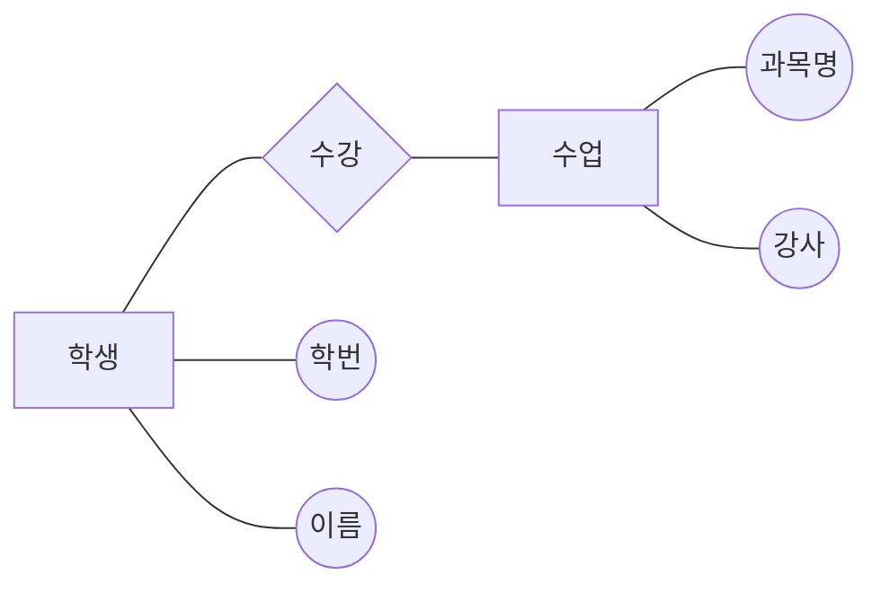

# 데이터베이스 설계

## 1. 데이터베이스 설계의 개요

### (1) 데이터베이스 설계의 정의

- 요구 조건에서 데이터베이스 구조를 도출하는 과정
- 데이터들을 효과적으로 관리하기 위해 데이터베이스의 구조를 체계적으로 조직화하는 작업

### (2) 데이터베이스 설계의 목적

- 이해관계자의 데이터 관점에서 요구사항을 정확히 이해하고 이를 추상화하는 것
- 데이터를 중심으로 한 이해관계자 간의 원활한 의사소통을 지원함

### (2) 데이터베이스 설계 시 고려사항

|      고려 사항      | 설명                                                                             |
| :-----------------: | :------------------------------------------------------------------------------- |
|      제약조건       | 저장된 데이터 값이 반드시 만족해야 하는 조건                                     |
| 데이터베이스 무결성 | 데이터의 삽입, 삭제, 갱신 연산 후에도 데이터 값이 제약조건을 유지하도록 보장     |
|       일관성        | 저장된 데이터 값 또는 특정 질의에 대한 응답이 모순없이 일치하는 특성             |
|        회복         | 시스템 장애 발생 시, 장애 직전의 일관된 데이터 상태로 복구하는 기법              |
|        보안         | 불법적인 데이터 변경, 손실, 노출에 대한 보호 기능 제공                           |
|       효율성        | 시스템의 응답 시간을 단축하고 저장 공간을 최적화하며 시스템 생상선을 향상하는 것 |
| 데이터베이스 확장성 | 시스템 운영에 영향을 주지 않고 새로운 데이터를 지속저긍로 추가할 수 있는 능력    |

## 2. 데이터베이스 설계 단계 _\*[20년 2회][21년 1회][23년 2회][26년 1회]_

### (1) 요구 조건 분석

- 데이터베이스의 사용자, 사용 목적, 사용 범위, 제약조건 등을 정리하여 명세서를 작성
- 트랜잭션의 유형과 실행 빈도 등 동적 데이터베이스 처리에 필요한 요구사항을 정의

### (2) 개념적 설계

- 현실 세계의 요구사항과 데이터를 추상적 관점에서 표현하는 단계
- DBMS에 독립적으로 데이터베이스를 설계하며, 데이터베이스의 개념적 스키마를 구성(ex: E-R 다이어그램)
- 트랜잭션 모델링과 정의를 수행

### (3) 논리적 설계

- 자료를 컴퓨터가 처리할 수 있도록 목표 DBMS의 논리적 자료구조로 변환하는 과정
- 목표 데이터 모델(ex: 계층형, 관계형, 객체지향형 등)을 기반으로 설계
- 관계형 데이터베이스의 경우, 테이블 설계 및 `정규화`를 이 단계에서 수행
- 트랜잭션 인터페이스 설계를 진행

### (4) 물리적 설계

- 특정 DBMS의 물리적 구조, 저장 구조, 데이터 타입의 특징, 인덱스 등을 고려하여 물리적 설계를 진행
- 데이터베이스의 물리적 스키마를 생성하며 트랜잭션의 세부 설계를 수행

### (5) 구현

- 특정 DBMS의 데이터 정의 언어(DDL)를 사용하여 데이터베이스의 스키마 생성 명령문을 작성, 컴파일, 실행하여 데이터베이스 스키마를 구축

## 3. 데이터 모델의 개념

> 현실 세계의 복잡한 데이터 구조를 단순화하고 추상화하여 체계적으로 표현한 개념적 모형

### (1) 데이터 모델 구조

| 번호 |  이름  |    연락처    |
| :--: | :----: | :----------: |
| 001  | 홍길동 | 010-123-4567 |
| 002  | 임꺽정 | 02-1234-4567 |
| 003  | 황진이 | 011-987-6543 |

|              구조              | 설명                                       |
| :----------------------------: | :----------------------------------------- |
|          개체(Entity)          | 저장할 만한 가치가 있는 현실 세계의 대상체 |
|     개체 타입(Entity Type)     | 개체를 구성하는 속성들의 집합              |
| 개체 인스턴스(Entity Instance) | 특정 개체 타입에 속하는 구체적인 개체      |
|     개체 세트(Entity Set)      | 개체 인스턴스들의 집합                     |
|        속성 (Attribute)        | 개체의 고유한 특성                         |
|        관계 (Relation)         | 개체와 개체 간의 연관성                    |

### (2) 데이터 모델에 표시해야 할 요소 _\*[21년 1회]_

|         요소          | 설명                            |
| :-------------------: | :------------------------------ |
|   구조 (Structure)    | 데이터 구조와 개체 간의 관계    |
|   연산 (Operation)    | 데이터를 처리하는 방법          |
| 제약조건 (Constraint) | 데이터의 논리적 제약조건을 정의 |

## 4. 개체-관계 모델(Entity-Relation Model)

> E-R 모델

- 데이터베이스 요구사항을 그래픽으로 표현하는 모델
- 개체(Entity), 속성 (Attribute), 관계 (Relation)를 사용하여 데이터를 기술
- 피터 첸이 제안한 모델로, 특정 DBMS나 하드웨어에 독립적임

### (1) 개체(Entity)

- 현실 세계에서 독립적이고 구별 가능한 대상을 의미
- ER 다이어그램에서 `사각형`으로 나타냄

### (2) 속성 (Attribute)

- 개체나 관계의 고유한 특성을 나타내는 정보의 단위
- 데이터베이스에 저장할 데이터의 가장 작은 논리적 단위
- ER 다이어그램에서 기본적으로 원으로 표시됨
- 속성의 유형
  - |     유형     | 설명                                                     |
    | :----------: | :------------------------------------------------------- |
    | 단일 값 속성 | 하나의 값만 갖는 속성 (예: 이름, 학번 등)                |
    | 다중 값 속성 | 여러 값을 갖는 속성 (예: 취미 등)                        |
    |  단순 속성   | 더 이상 분해할 수 없는 속성 (예: 성별 등)                |
    |  복합 속성   | 분해 가능한 속성 (예: 주소, 생년월일 등)                 |
    |  유도 속성   | 다른 속성에서 유도되는 속성 (예: 주민번호에서 성별 도출) |
    |   널 속성    | 값이 아직 결정되지 않았거나 존재하지 않는 속성           |
    |   키 속성    | 개체를 고유하게 구별하기 위한 속성                       |

### (3) 관계 (Relation)

- 두 개체 간의 의미 있는 연결을 의미
- ER 다이어그램에서 관계는 마름모로 나타냄

- `[]` 사각형 → 개체
- `{}` 마름모 → 관계
- `(())` 타원 → 속성

### (4) E-R 다이어그램 기호 \* _시험 출제_

| 기호 | 기호 이름 | 설명                |
| :--: | :-------: | :------------------ |
|  ▭   |  사각형   | 개체 (Entity)       |
|  ◇   |  마름모   | 관계 (Relationship) |
|  ○   |   타원    | 속성 (Attribute)    |
|  ɵ   | 밑줄 타원 | 기본키 속성         |
|  ◎   | 이중 타원 | 다중값 속성         |
|  ——  |  선 링크  | 개체와 속성 연결    |

## 5. 데이터 모델의 품질 기준

| 기준 항목 | 설명                                                                |
| :-------: | :------------------------------------------------------------------ |
|  정확성   | 모델이 표기법과 요구사항을 정확하게 반영하는 정도                   |
|  완전성   | 모델의 구성요소와 요구사항이 완전하게 반영되어 누락이 최소화된 상태 |
|  준거성   | 모든 준수 요건을 정확하게 준수하고 있는 정도                        |
|  최신성   | 모델이 현재 시스템 상태와 최근의 이슈 사항을 반영하고 있는지 여부   |
|  일관성   | 전체 모델 내에서 데이터 요소 간의 일관성이 유지되는 정도            |
|  활용성   | 모델이 이해관계자에게 의미를 쉽게 전달하고 유용하게 설계된 정도     |
